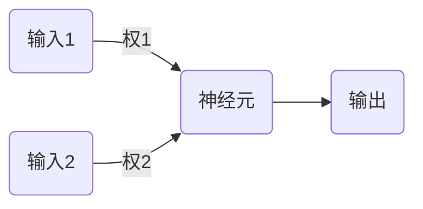
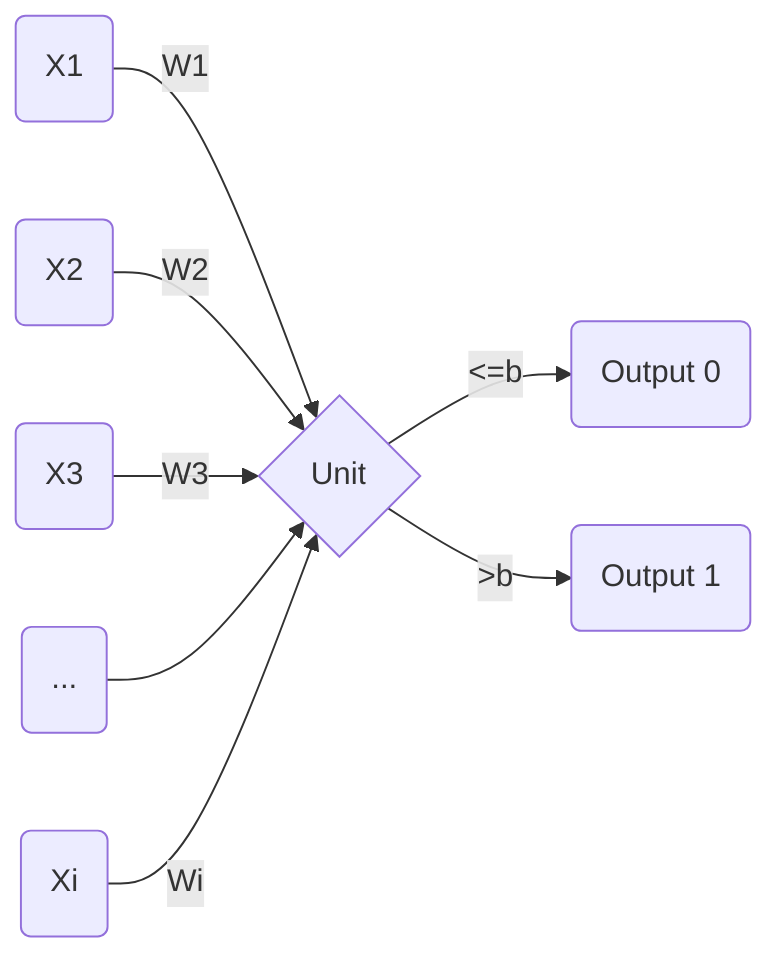
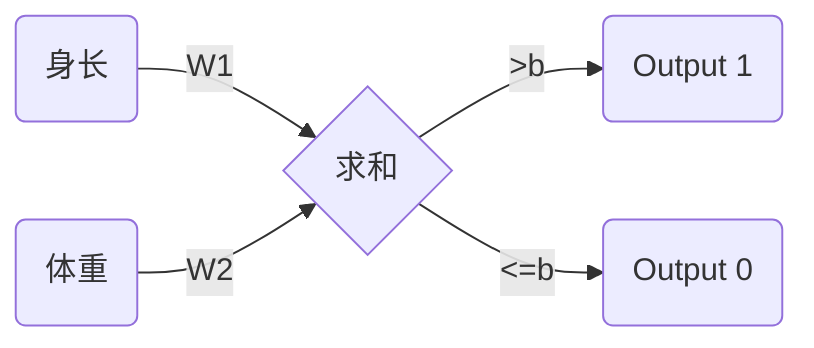

# EP01 鳄鱼和蛇

首先，让我们制作一个简单的人工智能

目标是输入一个动物的身长和体重，人工智能会帮助我们判断这是一只鳄鱼还是一条蛇  
（假设世界上只有鳄鱼和蛇两种动物）

人工智能的本质其实就是一堆神经元，假设现在有一个两个突触的神经元：



每一个输入有激发（输入为正）或抑制（输入为非正数）两种状态

我们记输入1的值为 $X_1$

输入2的值为 $X_2$

权1记为 $W_1$

权2记为 $W_2$

输出 $O$ 为 $1$ 或 $0$

神经元里面有一个常数 $b$

那么一个二元神经元就可以这样描述：

$$
X_1W_1+X_2W_2 > b
$$

此处的大于号不是条件符号，而是判断符号

每个输入加权之和如果大于 $b$ ，则输出 $1$ ，反之输出 $0$

而 $n$ 元神经元就可以表示为：

$$
\Sigma X_iW_i > b
$$



在鳄鱼与蛇的例子中，有两个输入和一个输出，所以用一个二元神经元即可



现在神经元已经设置好了，就差两个 $W$ 和 $b$ 的值的设置了

对于这个简单的例子，我们先随便设一个值，例如 $W_1=1$，$W_2=1$，$b=100$

由于后续会对神经网络进行训练，所以这里的 $b$ 值无论多少都无所谓

我们设定当神经元输出为 $1$ 时判断结果时鳄鱼，为 $0$ 时是蛇

简单写一个C++的Demo吧，数据我已经保存到 `data.txt` 中了

```cpp
#include <iostream>
using namespace std;
int main() {
    float data[10][3] = {
        {340, 360, 1},
        {460, 465, 1},
        {400, 160, 1},
        {316, 137.5, 1},
        {150, 36, 1},
        {150, 1.1, 0},
        {170, 2.3, 0},
        {359, 6, 0},
        {695, 59, 0},
        {521, 97.5, 0},
    };
    float w1 = 1, w2 = 1;
    int b = 100;
    for(int i = 0; i < 10; i++) {
        float x1 = data[i][0], x2 = data[i][1];
        int ans = data[i][2];
        float f = x1 * w1 + x2 * w2;
        int result = f > b;
        bool correct = result == ans;
        cout << result << ", " << correct << endl;
        // result是计算结果，correct是布尔值，表示计算是否正确
    }
    return 0;
}
```

每一行的输出的第一个数是计算结果（1=鳄鱼，0=蛇）

第二个数是是否正确（1=正确，0=错误）

运行看看

```shell
W:\Birth of an AI\EP01 鳄鱼与蛇> g++ demo.cpp -o demo.exe ; ./demo.exe
1, 1
1, 1
1, 1
1, 1
1, 1
1, 0
1, 0
1, 0
1, 0
1, 0
```

啊哦，看来结果不太对，所以需要对 $W_1$ 和 $W_2$ 的值进行调整

比方说，目光短浅地把 $W$ 调整到当前数据的结果正确（一共有十组数据）

假设当前数据输入计算结果为 $f$ ，则 $f=X_1W_1+X_2W_2$

已知能更改的只有两个 $W$ 的值

如果 $f>b$ ，判断为鳄鱼，如果判断错误了，需要使 $f<b$，$W$ 增加

如果 $f<b$ ，判断为蛇，如果判断错误了，需要使 $f>b$，$W$ 减小

增加或减小的值为 $\Delta W$

后面我们会详细学习这个值的设定方法，不过在这里目光短浅地把它定为 $0.1$

```cpp
#include <iostream>
using namespace std;
int main() {
    float data[10][3] = {
        {340, 360, 1},
        {460, 465, 1},
        {400, 160, 1},
        {316, 137.5, 1},
        {150, 36, 1},
        {150, 1.1, 0},
        {170, 2.3, 0},
        {359, 6, 0},
        {695, 59, 0},
        {521, 97.5, 0},
    };
    float w1 = 1, w2 = 1;
    float deltaw = 0.1;
    cin >> w1 >> w2;
    int b = 100;
    for(int i = 0; i < 10; i++) {
        float x1 = data[i][0], x2 = data[i][1];
        int ans = data[i][2];
        float f = x1 * w1 + x2 * w2;
        int result = f > b;
        bool correct = result == ans;
        cout << result << ", " << correct << endl;
        // result是计算结果，correct是布尔值，表示计算是否正确
        if(!correct) {
            if(result == 1) {
                w1 -= deltaw;
                w2 -= deltaw;
            } else {
                w1 += deltaw;
                w2 += deltaw;
            }
        }
    }
    cout << w1 << " " << w2;
    return 0;
}
```

因为现在的神经网络已经开始训练了，所以每次训练完成我们得保存下来 $W_1$ 和 $W_2$，以便下一次继续训练时可以接着这次的训练结果继续训练

运行看看

```shell
W:\Birth of an AI\EP01 鳄鱼与蛇> g++ demo.cpp -o demo.exe ; ./demo.exe
1 1
1, 1
1, 1
1, 1
1, 1
1, 1
1, 0
1, 0
1, 0
1, 0
1, 0
0.5 0.5
```

嗯，神经网络已经开始自我训练了，再训练一轮看看

```shell
W:\Birth of an AI\EP01 鳄鱼与蛇> g++ demo.cpp -o demo.exe ; ./demo.exe
0.5 0.5
1, 1
1, 1
1, 1
1, 1
0, 0
0, 1
1, 0
1, 0
1, 0
1, 0
0.2 0.2
```

快看！计算结果有两个数据出现了改变，且两个 $W$ 的值也在持续改变

多训练几次看看

```shell
W:\Birth of an AI\EP01 鳄鱼与蛇> g++ demo.cpp -o demo.exe ; ./demo.exe
0.2 0.2
1, 1
1, 1
1, 1
0, 0
0, 0
0, 1
0, 1
1, 0
1, 0
1, 0
0.1 0.1
W:\Birth of an AI\EP01 鳄鱼与蛇> g++ demo.cpp -o demo.exe ; ./demo.exe
0.1 0.1
0, 0
1, 1
1, 1
0, 0
0, 0
0, 1
0, 1
1, 0
1, 0
1, 0
0.1 0.1
```

诶呀，$W$ 的值陷入了循环，但此时的判断正确率和我们希望的还相差甚远

试一试调小 $\Delta W$，比如...... $0.01$ 怎么样

```shell
0.1 -> 0.13 -> 0.16 -> 0.18 -> 0.18 -> 0.18 -> ...
```

我省略了无用的部分，可以看见 $W$ 的值稳定在了 $0.18$，看看正确率怎么样

```shell
0.18 0.18
1, 1
1, 1
1, 1
0, 0
0, 0
0, 1
0, 1
0, 1
1, 0
1, 0
0.18 0.18
```

嗯，再调小 $\Delta W$ 试一试？改成 $0.001$ ？

先等等，虽然这样可能可行，但是这样意义并不大

因为随着 $\Delta W$ 减小，迭代效率也在一点点变低，这意味着一轮训练可以改变 $W$ 的值变小，也意味着训练变慢

在下一节中我们会改进算法，继续完成鳄鱼与蛇的分类

再见 :-)

## 作业

Fork[此仓库](https://github.com/MHYCWasTaken/Birth-of-an-AI)，在EP01文件夹中用你擅长的语言写一遍demo

在文件第一行注释作者，在README.md留下你的名字，并提交pull request
