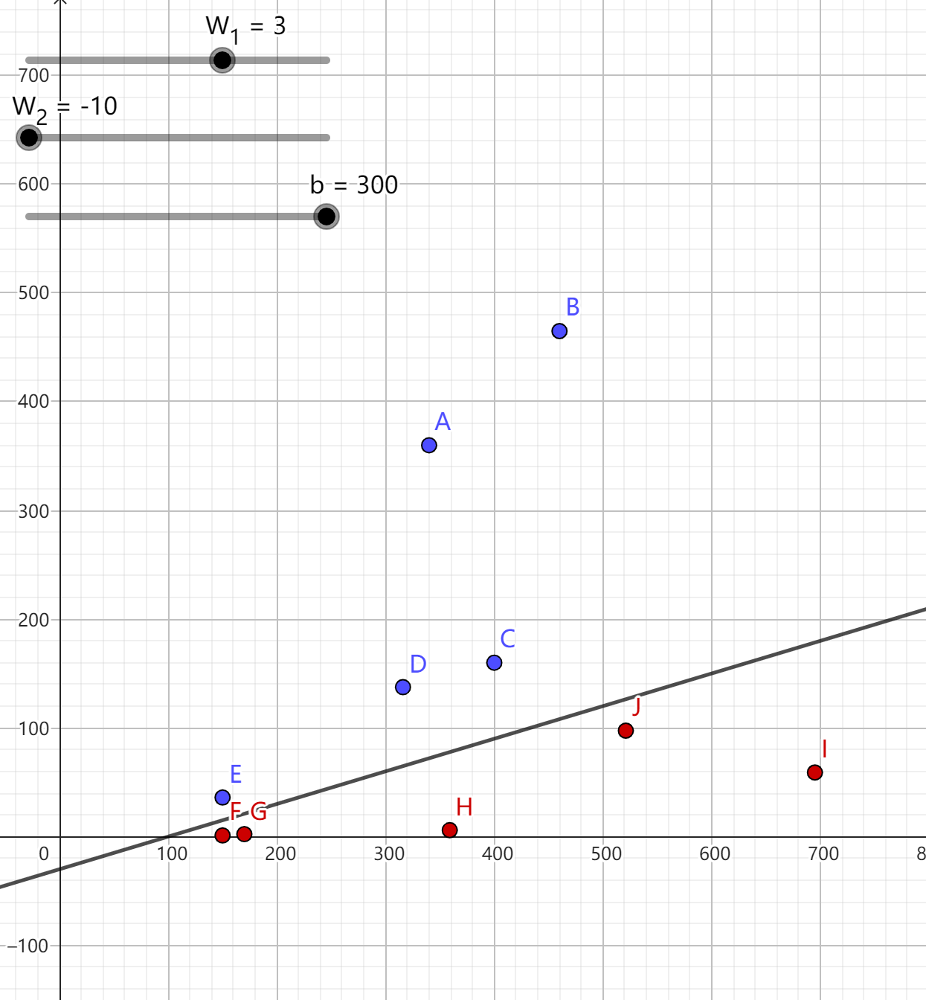
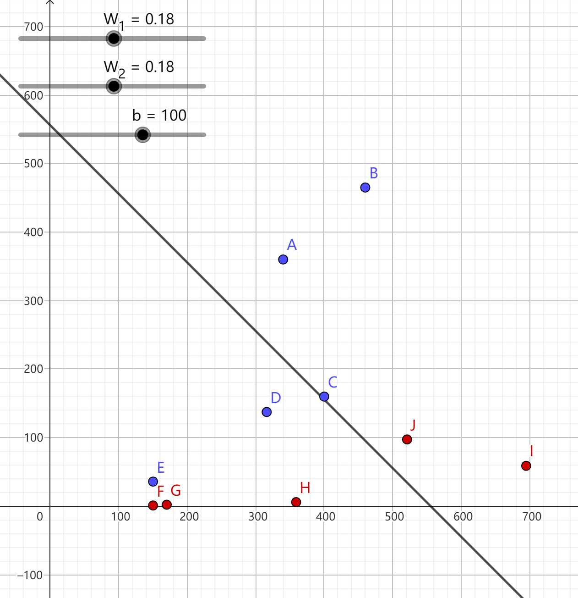
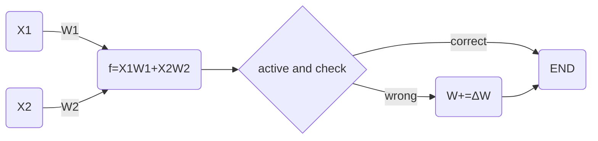

# EP02 坐标系

欢迎回来，首先请你用Geogebra（网页端或应用程序）打开我准备好的 `data.ggb`

你可以看见一堆点和一条线，每一个点都代表一组数据，$x$ 轴坐标是身长，$y$ 轴坐标是体重

蓝色的点是鳄鱼，紫色的点是蛇

那根线就是我们要找的分割线，也就是二元分类线

让我们看看这个直线的表达式

$$
W_1x+W_2y-b=0
$$

直线上方的点是鳄鱼（$f>b$），下方是蛇（$f\leqslant b$）

现在你可以通过滑条调整 $W_1$，$W_2$ 和 $b$，试试让那条线分割两种颜色的点



也可以试试输入上一节神经网络得到的两个 $W$ 试试



氦，难怪正确率不尽如人意呢

回到 $\Delta W_i$，上一节中 $\Delta W_i$ 设置为了定值

而我们需要一个非定值函数来表达 $\Delta W_i$

因为如果 $\Delta W_i$ 过大，正确率会十分低，过小则会导致效率下降

不难发现，对于 $X_1W_1+X_2W_2$，$X_1$ 和 $X_2$ 越大，对式子值影响越大

所以可以将 $\Delta W_i$ 设为 $X_i$ ，试一试结果怎样

```cpp
// Author MHYC133
#include <iostream>
using namespace std;
int main() {
    float data[10][3] = {
        {340, 360, 1},
        {460, 465, 1},
        {400, 160, 1},
        {316, 137.5, 1},
        {150, 36, 1},
        {150, 1.1, 0},
        {170, 2.3, 0},
        {359, 6, 0},
        {695, 59, 0},
        {521, 97.5, 0},
    };
    float w1 = 1, w2 = 1;
    cin >> w1 >> w2;
    int b = 100;
    for (int i = 0; i < 10; i++) {
        float x1 = data[i][0], x2 = data[i][1];
        int ans = data[i][2];
        float f = x1 * w1 + x2 * w2;
        int result = f > b;
        bool correct = result == ans;
        cout << result << ", " << correct << endl;
        // result是计算结果，correct是布尔值，表示计算是否正确
        if (!correct) {
            if (result == 1) {
                w1 -= x1;
                w2 -= x2;
            } else {
                w1 += x1;
                w2 += x2;
            }
        }
    }
    cout << w1 << " " << w2;
    return 0;
}
```

运行（省略了无用部分）

```shell
-149 -0.1

-129 356.5

-129 391.4

-129 391.4

-129 426.3

-129 461.2

W:\Birth of an AI\EP02 坐标系> g++ demo.cpp -o demo.exe ; ./demo.exe
-129 565.9
1, 1
1, 1
1, 1
1, 1
1, 1
0, 1
0, 1
0, 1
0, 1
0, 1
-129 565.9
```

哇，真酷，你已经成功训练出了人生中第一个100%正确率的神经网络！

所以代码能用了，来整理一下吧

```cpp
// Author MHYC133
#include <iostream>
#include <cstdio>
using namespace std;

float w1, w2;
float b;
float _data[10][3] = {
    {340, 360, 1},
    {460, 465, 1},
    {400, 160, 1},
    {316, 137.5, 1},
    {150, 36, 1},
    {150, 1.1, 0},
    {170, 2.3, 0},
    {359, 6, 0},
    {695, 59, 0},
    {521, 97.5, 0},
};
int dataCnt = 10;

// 从w.txt读取W1 W2
void readW() {
    freopen("w.txt", "r", stdin);
    cin >> w1 >> w2;
    fclose(stdin);
    return;
}

// 记录W1 W2到w.txt
void writeW() {
    freopen("w.txt", "w", stdout);
    cout << w1 << " " << w2;
    fclose(stdout);
    return;
}

// 展示W1 W2到控制台
void showW() {
    cout << "Value of W: ";
    cout << w1 << " " << w2 << endl;
    return;
}

// 计算ΔW
float getDeltaW(float x, float Y, float y) {
    /* 
     * 对于鳄鱼与蛇的例子，结果只有0（蛇）和1（鳄鱼）
     * 当判断错误，结果为蛇时，期望值Y为1F，现值y为0F，Y-y为1，即W+=ΔW
     * 当判断错误，结果为鳄鱼时，期望值Y为0F，现值y为1F，Y-y为-1，即W-=ΔW
     */
    return (Y - y) * x;
}

// 计算f
float getf(float x1, float w1, float x2, float w2, float b) {
    return x1 * w1 + x2 * w2 - b;
}

// 激活函数
float active(float f) {
    // 当f大于0输出1，小于等于0输出0
    return f > 0;
}

int main() {
    readW();
    for (int i = 0; i < dataCnt; i++) {
        float x1 = _data[i][0], x2 = _data[i][1], ans = _data[i][2];
        float f = getf(x1, w1, x2, w2, b);
        float actived = active(f);
        cout << "Data No." << i <<  "; actived: " << actived << "; answer: " << ans << "; is correct: " << (actived == ans) << endl;
        // result是计算结果，correct是布尔值，表示计算是否正确
        if (actived != ans) {
            w1 += getDeltaW(x1, ans, actived);
            w2 += getDeltaW(x2, ans, actived);
        }
    }
    showW();
    writeW();
    return 0;
}
```



将 W_1 和 W_2 初始值放入 `w.txt`，运行后自动记录 $W_1$ 和 $W_2$

运行

```shell
W:\Birth of an AI\EP04 加一层> g++ demo.cpp -o demo.exe ; ./demo.exe
Data No.0; actived: 1; answer: 1
Data No.1; actived: 1; answer: 1
Data No.2; actived: 1; answer: 1
Data No.3; actived: 1; answer: 1
Data No.4; actived: 1; answer: 1
Data No.5; actived: 1; answer: 0
Data No.6; actived: 0; answer: 0
Data No.7; actived: 0; answer: 0
Data No.8; actived: 0; answer: 0
Data No.9; actived: 0; answer: 0
Value of W: -149 -0.1
```

下一节，我们会进一步深入，研究一个全新的，更复杂的的问题

## 作业

- 手算一遍神经网络训练过程

- Fork[此仓库](https://gitlab.com/MHYCWasTaken/Birth-of-an-AI)，在EP02文件夹中用你擅长的语言写一遍demo  
在文件第一行注释作者，在README.md留下你的名字，并提交pull request
