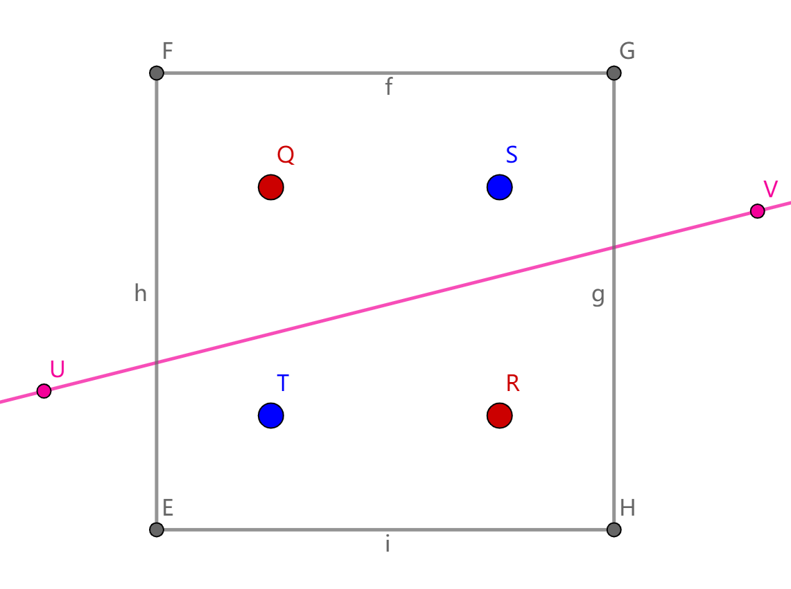
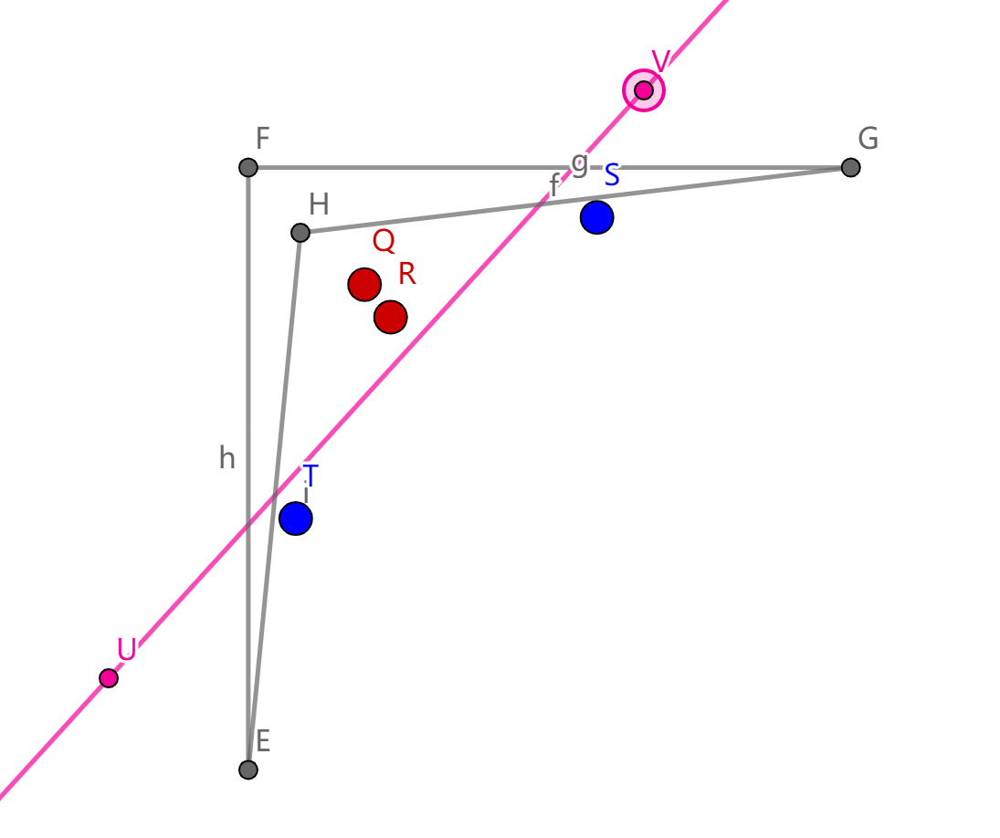

# EP03 不可能的任务

欢迎回来。

看下面一个坐标系，你要如何把不同的点用一条线分开？

不太现实，对吗？

给你个提示，只改变分割线是没有用的，但你可以考虑改变空间。

还不知道？

拉动边角四个点，试试改变坐标系（拖动灰色正方形的边或顶点）

酷，回顾一下刚才发生了什么

首先，我们有四个在坐标系上的坐标

然后把坐标丢到一个变换函数里，得到一个在屏幕上的绝对坐标

再二元分类变换后的点

这就是我们接下来的工作
