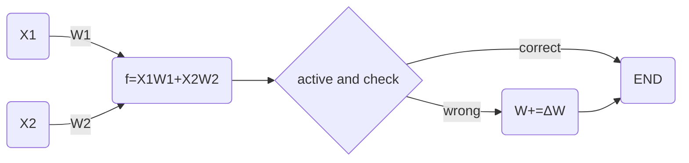
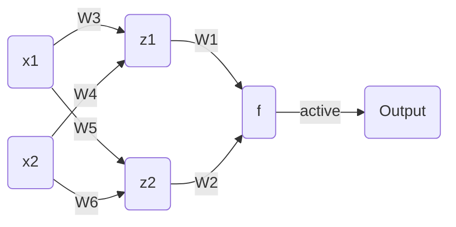

# EP04 加一层

欢迎回来

在开始之前，让我们重新整理一下之前的代码

```cpp
// Author MHYC133
#include <iostream>
#include <cstdio>
using namespace std;

float w1, w2;
float b;
float _data[10][3] = {
    {340, 360, 1},
    {460, 465, 1},
    {400, 160, 1},
    {316, 137.5, 1},
    {150, 36, 1},
    {150, 1.1, 0},
    {170, 2.3, 0},
    {359, 6, 0},
    {695, 59, 0},
    {521, 97.5, 0},
};
int dataCnt = 10;

// 从w.txt读取W1 W2
void readW() {
    freopen("w.txt", "r", stdin);
    cin >> w1 >> w2;
    fclose(stdin);
    return;
}

// 记录W1 W2到w.txt
void writeW() {
    freopen("w.txt", "w", stdout);
    cout << w1 << " " << w2;
    fclose(stdout);
    return;
}

// 展示W1 W2到控制台
void showW() {
    cout << "Value of W: ";
    cout << w1 << " " << w2 << endl;
    return;
}

// 计算ΔW
float getDeltaW(float x, float Y, float y) {
    /* 
     * 对于鳄鱼与蛇的例子，结果只有0（蛇）和1（鳄鱼）
     * 当判断错误，结果为蛇时，期望值Y为1F，现值y为0F，Y-y为1，即W+=ΔW
     * 当判断错误，结果为鳄鱼时，期望值Y为0F，现值y为1F，Y-y为-1，即W-=ΔW
     */
    return (Y - y) * x;
}

// 计算f
float getf(float x1, float w1, float x2, float w2, float b) {
    return x1 * w1 + x2 * w2 - b;
}

// 激活函数
float active(float f) {
    // 当f大于0输出1，小于等于0输出0
    return f > 0;
}

int main() {
    readW();
    for (int i = 0; i < dataCnt; i++) {
        float x1 = _data[i][0], x2 = _data[i][1], ans = _data[i][2];
        float f = getf(x1, w1, x2, w2, b);
        float actived = active(f);
        cout << "Data No." << i <<  "; actived: " << actived << "; answer: " << ans << "; is correct: " << (actived == ans) << endl;
        // result是计算结果，correct是布尔值，表示计算是否正确
        if (actived != ans) {
            w1 += getDeltaW(x1, ans, actived);
            w2 += getDeltaW(x2, ans, actived);
        }
    }
    showW();
    writeW();
    return 0;
}
```



将 W_1 和 W_2 初始值放入 `w.txt`，运行后自动记录 W_1 和 $W_2$

运行

```shell
W:\Birth of an AI\EP04 加一层> g++ demo.cpp -o demo.exe ; ./demo.exe
Data No.0; actived: 1; answer: 1
Data No.1; actived: 1; answer: 1
Data No.2; actived: 1; answer: 1
Data No.3; actived: 1; answer: 1
Data No.4; actived: 1; answer: 1
Data No.5; actived: 1; answer: 0
Data No.6; actived: 0; answer: 0
Data No.7; actived: 0; answer: 0
Data No.8; actived: 0; answer: 0
Data No.9; actived: 0; answer: 0
Value of W: -149 -0.1
```

----

在上一节的例子中，需要被分类的四个点被交叉放置

这种情况是线性函数无法应付的，也就是说这四个点无法被一条直线分开

所以刚刚你通过一个非线性变换，将一个平面直角坐标系变成了一个歪歪扭扭的坐标系

原来的点 $A(x_1,y_1)$ 变成了 $A'(x_2,y_2)$，所以这里有一个函数

$$
z(x_1,y_1)=(x_1W_3+y_1W_4,x_1W_5+y_1W_6)
$$

向他输入原来点的坐标 $(x_1,x_2)$ ，返回新的点的坐标 $(x_2,y_2)$

所以现在的神经网络像这样


