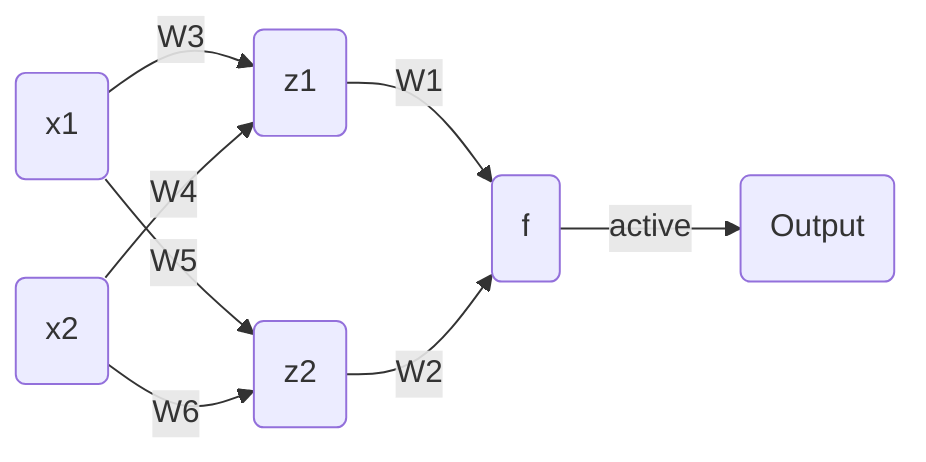

# EP04 加一层

⚠️ 施工中

---

欢迎回来

在上一节的例子中，需要被分类的四个点被交叉放置

这种情况是线性函数无法应付的，也就是说这四个点无法被一条直线分开

所以刚刚你通过一个非线性变换，将一个平面直角坐标系变成了一个歪歪扭扭的坐标系

原来的点 $A(x_1,y_1)$ 变成了 $A'(x_2,y_2)$，所以这里有一个函数

$$
z(x_1,y_1)=(x_1W_3+y_1W_4,x_1W_5+y_1W_6)
$$

向他输入原来点的坐标 $(x_1,x_2)$ ，返回新的点的坐标 $(x_2,y_2)$

所以现在的神经网络像这样

总结一下

1. 输入 $X_1$ $X_2$
2. 计算 $Z_1$ $Z_2$
3. 计算 $f$
4. 激活函数激活
5. 输出

