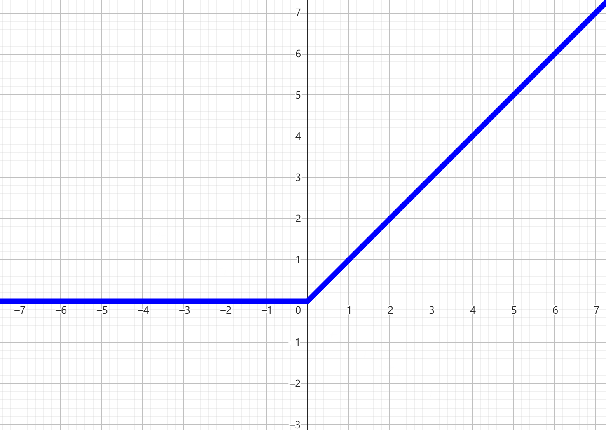

# EP04 加一层

欢迎回来

在上一节的例子中，需要被分类的四个点被交叉放置

这种情况是线性函数无法应付的，也就是说这四个点无法被一条直线分开

所以刚刚你通过一个非线性变换，将一个平面直角坐标系变成了一个歪歪扭扭的坐标系

原来的点 $A(x_1,y_1)$ 变成了 $A'(x_2,y_2)$

这原本是坐标系变换的知识点，需要用到矩阵计算，我先把答案告诉你

$$
z(x_1,y_1)=(x_1W_1+y_1W_2+b_1, x_1W_3+y_1W_4+b_2)
$$

向这个函数输入原来点的坐标 $(x_1,x_2)$ ，它返回新的点的坐标 $(z_1,z_2)$

所以现在的神经网络像这样

总结一下

1. 输入 $X_1$ $X_2$
2. 计算 $Z_1$ $Z_2$
3. 计算 $f$
4. 激活函数激活
5. 输出

先来看看计算 $Z_1,Z_2$ 的步骤

实际上就是坐标系变换，将一个矢量放入矩阵计算得到新的矢量，可以如下的矩阵表示

$$
\begin{bmatrix} Z_1 \\ Z_2 \end{bmatrix}
=
\begin{bmatrix}
W_1 & W_2 \\
W_3 & W_4
\end{bmatrix}
\begin{bmatrix} X_1 \\ X_2 \end{bmatrix}
+
\begin{bmatrix} b_1 \\ b_2 \end{bmatrix}
$$

没学过矩阵也没关系，上述矩阵可以直接表达为

$$
Z_1=X_1W_1+X_2W_2+b_1
$$

$$
Z_2=X_1W_3+X_2W_4+b_2
$$

你可以打开 `data.ggb` ，拉动右边的滑动条，自己试一试在计算 $Z_1,Z_2$ 时四个 $W$ 和两个 $b$ 值的影响

| W1   | W2   | W3   | W4   | b1   | b2   |
| ---- | ---- | ---- | ---- | ---- | ---- |
| 左右拉伸 | 左右切割 | 上下切割 | 上下拉伸 | 横向平移 | 纵向平移 |

接下来，加上激活函数，在这里先选用 `ReLU`，线性整流函数

$$
ReLU=\begin{cases}
0 & x < 0 \\
x & else
\end{cases}
$$

或者程序语言： `ReLU(float x) {return max(0, x);}`

函数图像（打开`ReLU.ggb`）

现在你可以打开 `data-ReLU.ggb` ，尝试将四个点变为线性可分

不错，可以分开了，接下来就是老生常谈的鳄鱼与蛇的问题了

但是到目前为止，都是人工手动调整参数，怎么样让机器自动调整参数呢

下节再见 :)
