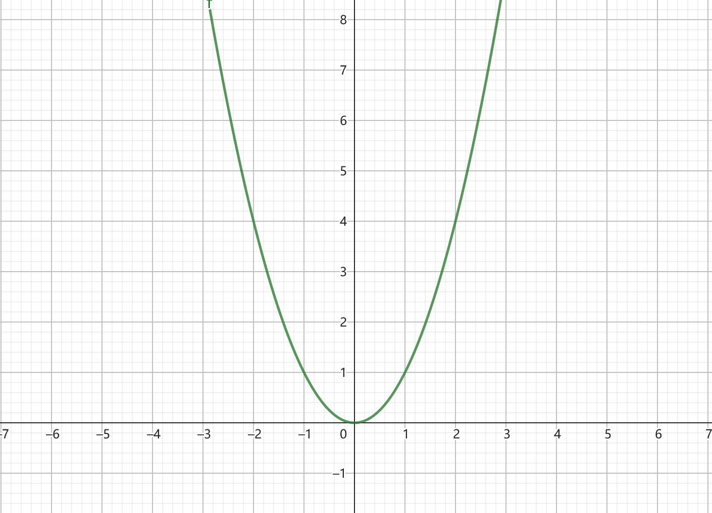
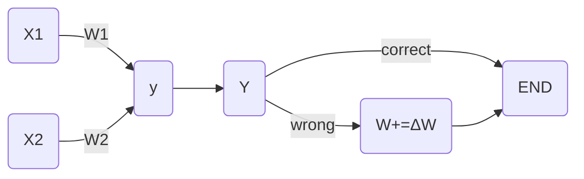
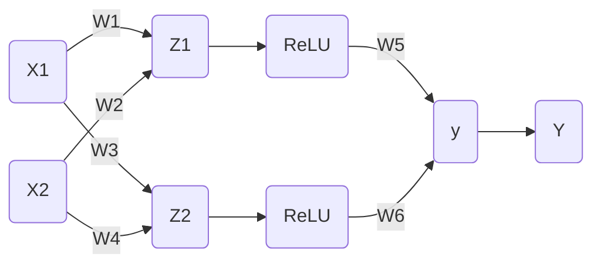

# EP05 梯度下降

⚠️ 施工中

---

现有一函数

$$
f(x)=x^2
$$

图像如下

现在函数图像上有一点 $Q$，如何找到 $Q'$ 使得 $Q'$ 点的 $y$ 值最小？

如果你是人类，应该可以一眼看出当 $x$ 取 $0$ 时， $y$ 值最小

但是很可惜，神经网络不会想你一样思考，那么神经网络如何找到最低点？

换句话说，当你作为一个点落在函数图像上时，怎么找到最低点？

先回到EP02中的简易单层网络，回顾一下之前的参数是如何自动调整的

那么 $\Delta W$ 如何计算？

$$
(Y-y)X_i
$$

由于 $Y$ 和 $y$ 只有 $0$ 和 $1$

- 当判断错误，结果为蛇时，期望值Y为1F，现值y为0F，Y-y为1，即W+=ΔW
- 当判断错误，结果为鳄鱼时，期望值Y为0F，现值y为1F，Y-y为-1，即W-=ΔW

首先，再仔细看一看这个神经网络

现在需要一个函数来计算每一个参数离期望值多远，这样就可以自动调整了，这个函数被称为损失函数

看看图，$y$ 是神经网络计算出的结果，$Y$ 是期望得到的结果（教练值）

在第二课中，$Y-y$ 就是损失函数，
