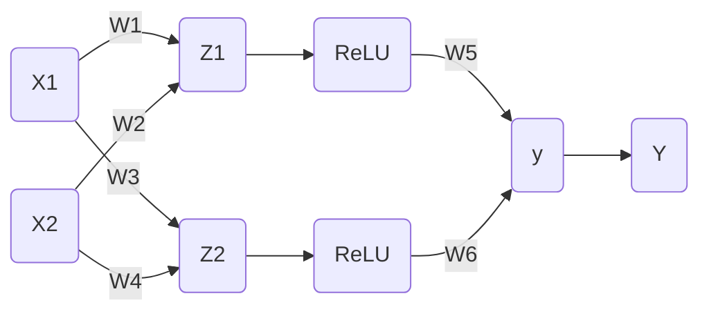

# EP05 梯度下降

⚠️ 施工中

---

欢迎回来

上一节我们的神经网络可以在人工调节下分隔线性不可分的数据了，这次我们的目标是让机器自动调整参数，完成分类

首先，再仔细看一看这个神经网络

现在需要一个函数来计算每一个参数离期望值多远，这样就可以自动调整了，这个函数被称为损失函数

看看图，$y$ 是神经网络计算出的结果，$Y$ 是期望得到的结果（教练值）

在第二课中，$Y-y$ 就是损失函数，
